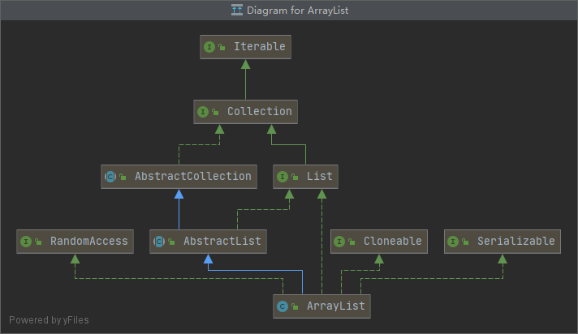
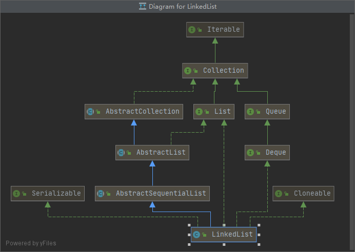

# ArrayList和LinkedList的区别 

*****


**集合和数组的区别**：

- 数组可以存储基本类型数据也可以是对象，而集合只能存储对象，包装类型
- 数组长度在初始化时指定，而集合不定长
- Array（数组）是基于索引(index)的数据结构，它使用索引在数组中搜索和读取数据是很快的, Array获取数据的时间复杂度是O(1),但是要删除数据却是开销很大，因为这需要重排数组中的所有数据, (因为删除数据以后, 需要把后面所有的数据前移) 

#### ArrayList 和 LinkedList 的区别

-  ArrayList底层的实现是Array, 数组扩容实现 ，即自动增长容量的数组， 而LinkedList底层是双向的列表

  - 数组是基于索引(index)的数据结构，搜索和读取数据效率高，时间复杂度是O(1), 但是删除和插入开销大，需要重排数组，索引位置也跟着改变。
  - LinkedList 是双向列表数据结构，所以插入和删除效率高，但是搜索和读取效率差

- LinkedList 底层是双链表,在添加和删除元素时具有比ArrayList更好的性能.但在get与set方面弱于 ArrayList.当然,这些对比都是指数据量很大或者操作很频繁。

  

### ArrayList



### LinkedList



```java
//底层结构，是个双向列表
private static class Node<E> {
    E item;
    Node<E> next;
    Node<E> prev;

    Node(Node<E> prev, E element, Node<E> next) {
    this.item = element;
    this.next = next;
    this.prev = prev;
    }
}
```


*****

- 因为ArrayList 实现了RandomAccess接口，根据经验，对于类的典型实例，如果实现此循环

``` java
// 根据经验，对于类的典型实例，如果实现此循环，则List实现应实现此接口：
for (int i=0, n=list.size(); i < n; i++){	list.get(i);}
比这个循环运行更快：
for (Iterator i=list.iterator(); i.hasNext(); ) {i.next();}
```


